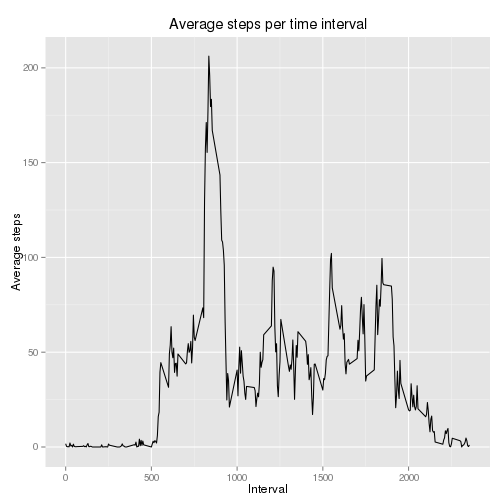
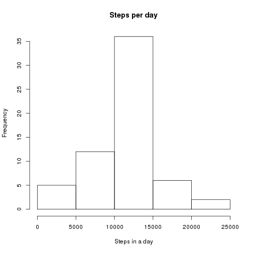
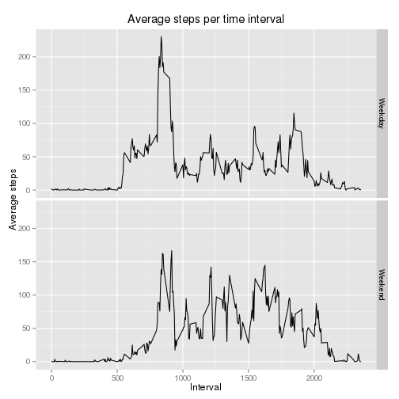

## Libraries.

Some effort was put into making this document dependant on a few libraries as possible.
The only requirement is the ggplot2 library.

```r
library("ggplot2")
```

## Loading and preprocessing the data

The data is loaded into an R data frame.

```r
unzip("activity.zip")
data <- read.csv("activity.csv")
```

The date column is parsed as Date objects.

```r
data$date <- as.Date(data$date)
```

A copy of the complete cases is created.

```r
cc <- data[complete.cases(data),];
```


## What is mean total number of steps taken per day?

Aggregate the data adding the steps per day and plot a histogram.

```r
stepsDaily <- aggregate(list(steps=cc$steps), by=list(day=cc$date), FUN=sum)
hist(stepsDaily$steps, main = "Steps per day", xlab = "Steps in a day")
```

 

Mean number of steps taken per day:

```r
mean(stepsDaily$steps)
```

```
## [1] 10766.19
```

Median number of steps taken per day:

```r
median(stepsDaily$steps)
```

```
## [1] 10765
```


## What is the average daily activity pattern?

Sum the steps taken in each interval accross all days, then plot a time series.

```r
interval <- aggregate(list(avgsteps=cc$steps), by=list(interval=cc$interval), FUN=mean)
ggplot(data=interval, aes(x=interval, y=avgsteps)) +
    geom_line() +
    ggtitle(expression('Average steps per time interval')) +
    ylab('Average steps') +
    xlab('Interval')
```

 

Determine the interval with, on average, the biggest number of steps.

```r
maxSteps <- which.max(interval$avgsteps)
interval[maxSteps,]
```

```
##     interval avgsteps
## 104      835 206.1698
```


## Imputing missing values

Count the missing values.

```r
sum(is.na(data$steps))
```

```
## [1] 2304
```


Fill missing values with the average for each interval, which we already have computed.

```r
# Merge the interval means to the activity data.
copy <- merge(data, interval, by="interval")
# Then copy the interval averages over the missing values.
copy$steps[is.na(copy$steps)] <- copy$avgsteps[is.na(copy$steps)]
```


Plot a histogram of the filled data.

```r
filled <- aggregate(list(steps=copy$steps), by=list(day=copy$date), FUN=sum)
hist(filled$steps)
```

 

Mean number of steps taken per day:

```r
mean(filled$steps)
```

```
## [1] 10766.19
```

Median number of steps taken per day:

```r
median(filled$steps)
```

```
## [1] 10766.19
```

In comparisson to the complete cases, the mean number of steps is unchanged, but the median does change slightly. Even though the mean and median remain largely the same, the total number of steps per day increases, which can be seen in the histogram.

## Are there differences in activity patterns between weekdays and weekends?

We need to create a new factor variable to indicate whether the measurement was made in a weekend or a weekday. First, we create a column with a logical vector indicating that.

```r
weekdays <- c("Mon", "Tue", "Wed", "Thu", "Fri")
copy$daytype <- weekdays(copy$date, abbreviate=TRUE) %in% weekdays
```

Next we replace the logical values with their respective string representations.

```r
copy$daytype[copy$daytype==TRUE]  <- 'Weekday'
copy$daytype[copy$daytype==FALSE]  <- 'Weekend'
```

We finally convert the column into a Factor.

```r
copy$daytype <- as.factor(copy$daytype)
```

We can now plot and compare the average steps taken per interval in weekends and weekdays.

```r
interval.filled <- aggregate(list(avgsteps=copy$steps), by=list(interval=copy$interval, tod=copy$daytype), FUN=mean)
ggplot(data=interval.filled, aes(x=interval, y=avgsteps)) +
    facet_grid(tod~.) +
    geom_line() +
    ggtitle(expression('Average steps per time interval')) +
    ylab('Average steps') +
    xlab('Interval')
```

 

It appears that activities are more evenly distributed throghout the day on weekends, whereas they seem to be more concentrated in the earlier parts of the weekdays.


